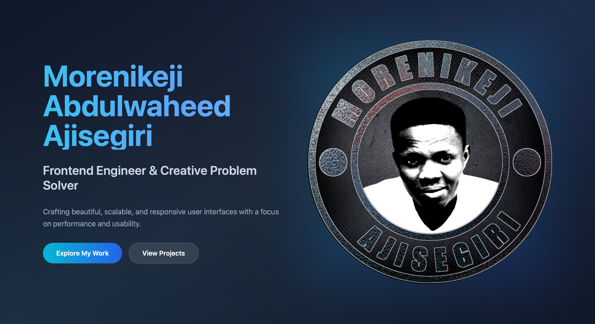
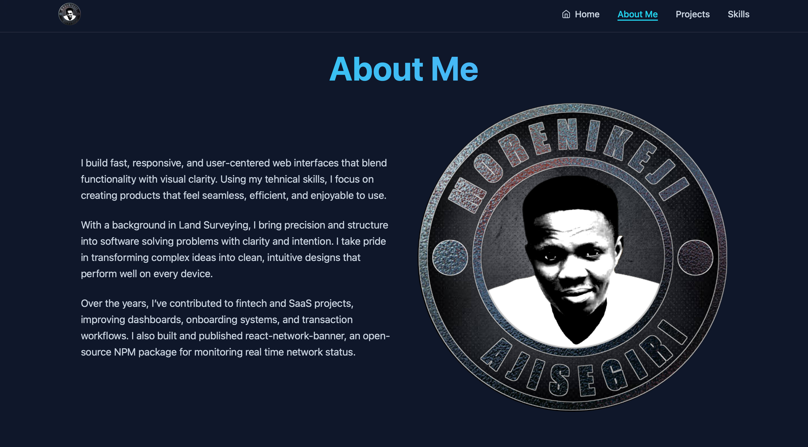
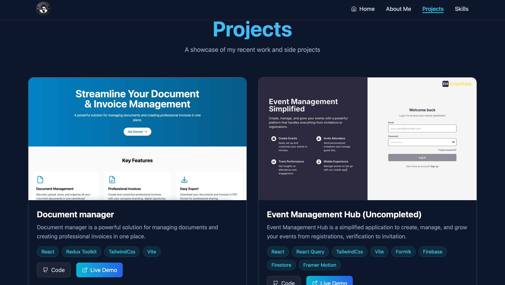

# 💼 Morenikeji Ajisegiri — Portfolio

A modern and responsive developer portfolio that showcases creativity, technical expertise, and a passion for building elegant, high-performance web applications.

---

## 🚀 Overview

**My Portfolio** is a sleek, single-page React application built with **React - Vite**, **Typescript**, and **Tailwind CSS** — designed to highlight my work, skills, and personal story.  
It presents an engaging experience through clean design, fluid animations, and responsive layouts, making it easy for recruiters and collaborators to explore my professional journey.

---

## ✨ Key Features

- 🧑‍💻 **About Me Section**  
  A concise introduction detailing background, expertise, and technologies I work with.

- 🧩 **Projects Showcase**  
  Displays featured projects with live demos and source code links.

- 🎨 **Modern Animations**  
  Subtle, smooth transitions and motion effects with Framer Motion.

- 🌈 **Responsive Design**  
  Tailwind-powered layouts that adapt beautifully to all devices.

- ⚡ **Optimized Performance**  
  Lightweight architecture built with Vite for blazing-fast load times.

---

## 🖼 Screenshots

### 🔹 Landing Page

### 🔹 About Me section

### 🔹 Projects Section

---

## 🛠 Built With

- **React + Vite** – Fast and modular frontend framework  
- **TypeScript** – Strongly typed JavaScript for scalable and maintainable code 
- **Tailwind CSS** – Utility-first styling for responsive design  
- **Framer Motion** – Smooth, modern animations  

---

## 🌟 Live Demo

👉 [View Portfolio](https://morenikejis.netlify.app)

---